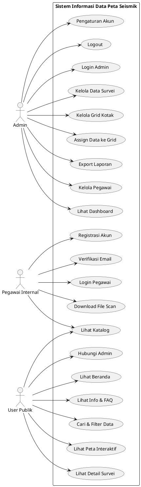
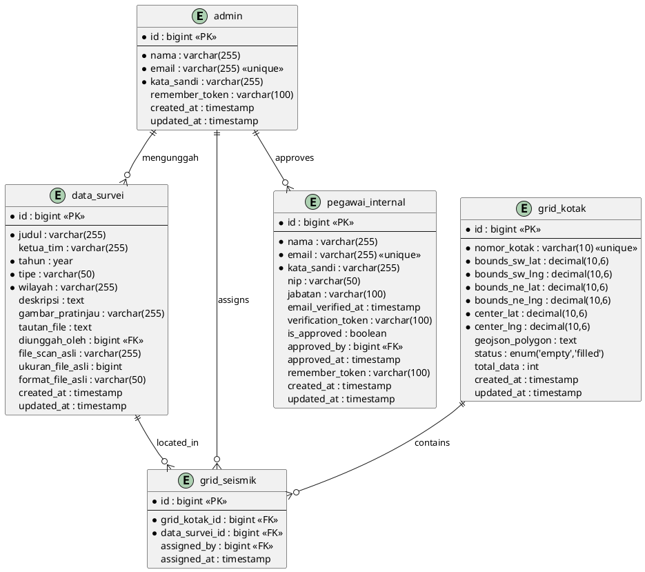
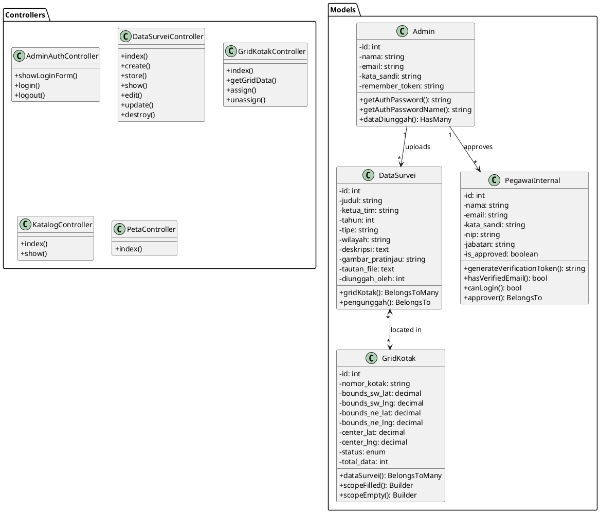

# Diagram Laporan PKL - Sistem Informasi Data Peta Seismik
## BBSPGL (Balai Besar Survei dan Pemetaan Geologi Laut)

Dokumen ini berisi diagram-diagram untuk keperluan laporan PKL.

---

## 1. USE CASE DIAGRAM

### 1.1 Deskripsi Use Case Diagram

```
┌─────────────────────────────────────────────────────────────────────────────────┐
│                    SISTEM INFORMASI DATA PETA SEISMIK                           │
│                                                                                 │
│  ┌─────────────────────────────────────────────────────────────────────────┐   │
│  │                         << ADMIN >>                                      │   │
│  │                                                                          │   │
│  │   ┌─────────────────┐    ┌─────────────────┐    ┌─────────────────┐     │   │
│  │   │  Login Admin    │    │ Kelola Data     │    │ Kelola Grid     │     │   │
│  │   │                 │    │ Survei (CRUD)   │    │ Kotak           │     │   │
│  │   └─────────────────┘    └─────────────────┘    └─────────────────┘     │   │
│  │                                                                          │   │
│  │   ┌─────────────────┐    ┌─────────────────┐    ┌─────────────────┐     │   │
│  │   │ Assign Data ke  │    │ Export Laporan  │    │ Kelola Pegawai  │     │   │
│  │   │ Grid Kotak      │    │ (PDF/Excel)     │    │ Internal        │     │   │
│  │   └─────────────────┘    └─────────────────┘    └─────────────────┘     │   │
│  │                                                                          │   │
│  │   ┌─────────────────┐    ┌─────────────────┐    ┌─────────────────┐     │   │
│  │   │ Lihat Dashboard │    │ Pengaturan      │    │ Logout          │     │   │
│  │   │ & Statistik     │    │ Akun            │    │                 │     │   │
│  │   └─────────────────┘    └─────────────────┘    └─────────────────┘     │   │
│  │                                                                          │   │
│  └─────────────────────────────────────────────────────────────────────────┘   │
│                                                                                 │
│  ┌─────────────────────────────────────────────────────────────────────────┐   │
│  │                       << PEGAWAI INTERNAL >>                             │   │
│  │                                                                          │   │
│  │   ┌─────────────────┐    ┌─────────────────┐    ┌─────────────────┐     │   │
│  │   │ Registrasi      │    │ Verifikasi      │    │ Login           │     │   │
│  │   │ Akun            │    │ Email           │    │                 │     │   │
│  │   └─────────────────┘    └─────────────────┘    └─────────────────┘     │   │
│  │                                                                          │   │
│  │   ┌─────────────────┐    ┌─────────────────┐                             │   │
│  │   │ Lihat Katalog   │    │ Download File   │                             │   │
│  │   │ Survei          │    │ Scan Asli       │                             │   │
│  │   └─────────────────┘    └─────────────────┘                             │   │
│  │                                                                          │   │
│  └─────────────────────────────────────────────────────────────────────────┘   │
│                                                                                 │
│  ┌─────────────────────────────────────────────────────────────────────────┐   │
│  │                        << USER PUBLIK >>                                 │   │
│  │                                                                          │   │
│  │   ┌─────────────────┐    ┌─────────────────┐    ┌─────────────────┐     │   │
│  │   │ Lihat Beranda   │    │ Lihat Katalog   │    │ Cari & Filter   │     │   │
│  │   │                 │    │ Survei          │    │ Data            │     │   │
│  │   └─────────────────┘    └─────────────────┘    └─────────────────┘     │   │
│  │                                                                          │   │
│  │   ┌─────────────────┐    ┌─────────────────┐    ┌─────────────────┐     │   │
│  │   │ Lihat Peta      │    │ Lihat Detail    │    │ Hubungi Admin   │     │   │
│  │   │ Interaktif      │    │ Survei          │    │ (Kontak)        │     │   │
│  │   └─────────────────┘    └─────────────────┘    └─────────────────┘     │   │
│  │                                                                          │   │
│  │   ┌─────────────────┐    ┌─────────────────┐                             │   │
│  │   │ Lihat Info      │    │ Lihat FAQ       │                             │   │
│  │   │ Tentang Kami    │    │                 │                             │   │
│  │   └─────────────────┘    └─────────────────┘                             │   │
│  │                                                                          │   │
│  └─────────────────────────────────────────────────────────────────────────┘   │
│                                                                                 │
└─────────────────────────────────────────────────────────────────────────────────┘
```

### 1.2 Tabel Deskripsi Use Case

| No | Use Case | Aktor | Deskripsi |
|----|----------|-------|-----------|
| 1 | Login Admin | Admin | Admin melakukan autentikasi untuk mengakses panel admin |
| 2 | Kelola Data Survei | Admin | Admin dapat menambah, mengubah, menghapus dan melihat data survei |
| 3 | Kelola Grid Kotak | Admin | Admin mengelola lokasi grid/kotak pada peta |
| 4 | Assign Data ke Grid | Admin | Admin menghubungkan data survei dengan lokasi grid kotak |
| 5 | Export Laporan | Admin | Admin mengekspor laporan dalam format PDF atau Excel |
| 6 | Kelola Pegawai Internal | Admin | Admin menyetujui/menolak registrasi pegawai internal |
| 7 | Lihat Dashboard | Admin | Admin melihat statistik dan ringkasan sistem |
| 8 | Pengaturan Akun | Admin | Admin mengubah profil dan password |
| 9 | Registrasi Akun Pegawai | Pegawai Internal | Pegawai mendaftar dengan email @esdm.go.id |
| 10 | Verifikasi Email | Pegawai Internal | Pegawai memverifikasi email melalui link |
| 11 | Download File Scan | Pegawai Internal | Pegawai mengunduh file scan asli survei |
| 12 | Lihat Beranda | User Publik | User melihat halaman utama website |
| 13 | Lihat Katalog | User Publik | User melihat daftar data survei yang tersedia |
| 14 | Cari & Filter Data | User Publik | User mencari dan memfilter data berdasarkan kriteria |
| 15 | Lihat Peta Interaktif | User Publik | User melihat peta dengan lokasi data survei |
| 16 | Lihat Detail Survei | User Publik | User melihat informasi lengkap sebuah survei |
| 17 | Hubungi Admin | User Publik | User mengirim pesan melalui form kontak |

---

## 2. ENTITY RELATIONSHIP DIAGRAM (ERD)

### 2.1 ERD dalam Notasi Crow's Foot

```
┌───────────────────────────────────────────────────────────────────────────────────┐
│                           ENTITY RELATIONSHIP DIAGRAM                              │
│                        Sistem Informasi Data Peta Seismik                          │
└───────────────────────────────────────────────────────────────────────────────────┘

                                    ┌────────────────┐
                                    │     ADMIN      │
                                    ├────────────────┤
                                    │ PK id          │
                                    │    nama        │
                                    │    email       │
                                    │    kata_sandi  │
                                    │    remember_   │
                                    │    token       │
                                    │    created_at  │
                                    │    updated_at  │
                                    └───────┬────────┘
                                            │
                                            │ 1
                                            │
                                            │ mengunggah
                                            │
                                            │ 0..*
                                            ▼
┌────────────────────┐           ┌──────────────────────────┐           ┌────────────────────┐
│    GRID_KOTAK      │           │       DATA_SURVEI        │           │  PEGAWAI_INTERNAL  │
├────────────────────┤           ├──────────────────────────┤           ├────────────────────┤
│ PK id              │           │ PK id                    │           │ PK id              │
│    nomor_kotak     │◄─────────►│    judul                 │           │    nama            │
│    bounds_sw_lat   │   M:M     │    ketua_tim             │           │    email           │
│    bounds_sw_lng   │           │    tahun                 │           │    kata_sandi      │
│    bounds_ne_lat   │           │    tipe                  │           │    nip             │
│    bounds_ne_lng   │           │    wilayah               │           │    jabatan         │
│    center_lat      │           │    deskripsi             │           │    email_verified_ │
│    center_lng      │           │    gambar_pratinjau      │           │    at              │
│    geojson_polygon │           │    tautan_file           │           │    verification_   │
│    status          │           │ FK diunggah_oleh         │           │    token           │
│    total_data      │           │    file_scan_asli        │           │    is_approved     │
│    created_at      │           │    ukuran_file_asli      │           │ FK approved_by     │
│    updated_at      │           │    format_file_asli      │           │    approved_at     │
└────────────────────┘           │    created_at            │           │    remember_token  │
         │                       │    updated_at            │           │    created_at      │
         │                       └──────────────────────────┘           │    updated_at      │
         │                                  │                           └────────────────────┘
         │                                  │                                    │
         │                                  │                                    │
         │                                  │                                    │
         │              ┌───────────────────┼───────────────────┐               │
         │              │                   │                   │               │
         │              │                   │                   │               │
         │              ▼                   ▼                   │               │
         │    ┌──────────────────────────────────────┐         │               │
         │    │           GRID_SEISMIK               │         │               │
         └───►│        (Pivot/Junction Table)        │◄────────┘               │
              ├──────────────────────────────────────┤                         │
              │ PK id                                │                         │
              │ FK grid_kotak_id                     │                         │
              │ FK data_survei_id                    │                         │
              │ FK assigned_by                       │◄────────────────────────┘
              │    assigned_at                       │         (approver)
              └──────────────────────────────────────┘


                                    ┌────────────────┐
                                    │     USERS      │
                                    ├────────────────┤
                                    │ PK id          │
                                    │    name        │
                                    │    email       │
                                    │    password    │
                                    │    email_      │
                                    │    verified_at │
                                    │    remember_   │
                                    │    token       │
                                    │    created_at  │
                                    │    updated_at  │
                                    └────────────────┘
```

### 2.2 Tabel Struktur Database

#### Tabel: `admin`
| Kolom | Tipe Data | Constraint | Keterangan |
|-------|-----------|------------|------------|
| id | BIGINT UNSIGNED | PRIMARY KEY, AUTO_INCREMENT | ID unik admin |
| nama | VARCHAR(255) | NOT NULL | Nama admin |
| email | VARCHAR(255) | NOT NULL, UNIQUE | Email admin |
| kata_sandi | VARCHAR(255) | NOT NULL | Password terenkripsi |
| remember_token | VARCHAR(100) | NULLABLE | Token untuk remember me |
| created_at | TIMESTAMP | NULLABLE | Waktu dibuat |
| updated_at | TIMESTAMP | NULLABLE | Waktu diperbarui |

#### Tabel: `data_survei`
| Kolom | Tipe Data | Constraint | Keterangan |
|-------|-----------|------------|------------|
| id | BIGINT UNSIGNED | PRIMARY KEY, AUTO_INCREMENT | ID unik survei |
| judul | VARCHAR(255) | NOT NULL | Judul survei |
| ketua_tim | VARCHAR(255) | NULLABLE | Nama ketua tim survei |
| tahun | YEAR | NOT NULL | Tahun pelaksanaan survei |
| tipe | VARCHAR(50) | NOT NULL | Tipe survei (2D, 3D, HR) |
| wilayah | VARCHAR(255) | NOT NULL | Wilayah survei |
| deskripsi | TEXT | NULLABLE | Deskripsi survei |
| gambar_pratinjau | VARCHAR(255) | NULLABLE | Path gambar pratinjau |
| tautan_file | TEXT | NULLABLE | Link file data survei |
| diunggah_oleh | BIGINT UNSIGNED | FOREIGN KEY → admin(id) | ID admin pengunggah |
| file_scan_asli | VARCHAR(255) | NULLABLE | Path file scan asli |
| ukuran_file_asli | BIGINT | NULLABLE | Ukuran file dalam bytes |
| format_file_asli | VARCHAR(50) | NULLABLE | Format file (pdf, tiff, dll) |
| created_at | TIMESTAMP | NULLABLE | Waktu dibuat |
| updated_at | TIMESTAMP | NULLABLE | Waktu diperbarui |

#### Tabel: `grid_kotak`
| Kolom | Tipe Data | Constraint | Keterangan |
|-------|-----------|------------|------------|
| id | BIGINT UNSIGNED | PRIMARY KEY, AUTO_INCREMENT | ID unik grid |
| nomor_kotak | VARCHAR(10) | NOT NULL, UNIQUE | Nomor kotak (4 digit) |
| bounds_sw_lat | DECIMAL(10,6) | NOT NULL | Latitude sudut barat daya |
| bounds_sw_lng | DECIMAL(10,6) | NOT NULL | Longitude sudut barat daya |
| bounds_ne_lat | DECIMAL(10,6) | NOT NULL | Latitude sudut timur laut |
| bounds_ne_lng | DECIMAL(10,6) | NOT NULL | Longitude sudut timur laut |
| center_lat | DECIMAL(10,6) | NOT NULL | Latitude titik tengah |
| center_lng | DECIMAL(10,6) | NOT NULL | Longitude titik tengah |
| geojson_polygon | TEXT | NULLABLE | Data GeoJSON polygon |
| status | ENUM('empty','filled') | DEFAULT 'empty' | Status grid |
| total_data | INTEGER | DEFAULT 0 | Jumlah data di grid |
| created_at | TIMESTAMP | NULLABLE | Waktu dibuat |
| updated_at | TIMESTAMP | NULLABLE | Waktu diperbarui |

#### Tabel: `grid_seismik` (Pivot Table)
| Kolom | Tipe Data | Constraint | Keterangan |
|-------|-----------|------------|------------|
| id | BIGINT UNSIGNED | PRIMARY KEY, AUTO_INCREMENT | ID unik |
| grid_kotak_id | BIGINT UNSIGNED | FOREIGN KEY → grid_kotak(id), ON DELETE CASCADE | ID grid kotak |
| data_survei_id | BIGINT UNSIGNED | FOREIGN KEY → data_survei(id), ON DELETE CASCADE | ID data survei |
| assigned_by | BIGINT UNSIGNED | FOREIGN KEY → admin(id), ON DELETE SET NULL | ID admin yang assign |
| assigned_at | TIMESTAMP | DEFAULT CURRENT_TIMESTAMP | Waktu assign |

#### Tabel: `pegawai_internal`
| Kolom | Tipe Data | Constraint | Keterangan |
|-------|-----------|------------|------------|
| id | BIGINT UNSIGNED | PRIMARY KEY, AUTO_INCREMENT | ID unik pegawai |
| nama | VARCHAR(255) | NOT NULL | Nama pegawai |
| email | VARCHAR(255) | NOT NULL, UNIQUE | Email pegawai (@esdm.go.id) |
| kata_sandi | VARCHAR(255) | NOT NULL | Password terenkripsi |
| nip | VARCHAR(50) | NULLABLE | Nomor Induk Pegawai |
| jabatan | VARCHAR(100) | NULLABLE | Jabatan pegawai |
| email_verified_at | TIMESTAMP | NULLABLE | Waktu verifikasi email |
| verification_token | VARCHAR(100) | NULLABLE | Token verifikasi |
| verification_token_expires_at | TIMESTAMP | NULLABLE | Waktu kadaluarsa token |
| is_approved | BOOLEAN | DEFAULT FALSE | Status approval |
| approved_by | BIGINT UNSIGNED | FOREIGN KEY → admin(id) | ID admin yang approve |
| approved_at | TIMESTAMP | NULLABLE | Waktu approval |
| remember_token | VARCHAR(100) | NULLABLE | Token remember me |
| created_at | TIMESTAMP | NULLABLE | Waktu dibuat |
| updated_at | TIMESTAMP | NULLABLE | Waktu diperbarui |

### 2.3 Relasi Antar Tabel

| No | Tabel 1 | Relasi | Tabel 2 | Keterangan |
|----|---------|--------|---------|------------|
| 1 | admin | 1:N (One to Many) | data_survei | Satu admin dapat mengunggah banyak data survei |
| 2 | data_survei | M:N (Many to Many) | grid_kotak | Satu survei bisa di banyak grid, satu grid bisa punya banyak survei |
| 3 | admin | 1:N (One to Many) | grid_seismik | Satu admin dapat meng-assign banyak data ke grid |
| 4 | admin | 1:N (One to Many) | pegawai_internal | Satu admin dapat meng-approve banyak pegawai |

---

## 3. CLASS DIAGRAM

### 3.1 Class Diagram dalam UML

```
┌─────────────────────────────────────────────────────────────────────────────────────────┐
│                                    CLASS DIAGRAM                                         │
│                           Sistem Informasi Data Peta Seismik                             │
└─────────────────────────────────────────────────────────────────────────────────────────┘

                              << Model Classes (Eloquent) >>

    ┌─────────────────────────────┐                    ┌─────────────────────────────┐
    │         <<Model>>           │                    │         <<Model>>           │
    │           Admin             │                    │          User               │
    ├─────────────────────────────┤                    ├─────────────────────────────┤
    │ - id: int                   │                    │ - id: int                   │
    │ - nama: string              │                    │ - name: string              │
    │ - email: string             │                    │ - email: string             │
    │ - kata_sandi: string        │                    │ - password: string          │
    │ - remember_token: string    │                    │ - email_verified_at: datetime│
    │ - created_at: timestamp     │                    │ - remember_token: string    │
    │ - updated_at: timestamp     │                    │ - created_at: timestamp     │
    ├─────────────────────────────┤                    │ - updated_at: timestamp     │
    │ + getAuthPassword(): string │                    ├─────────────────────────────┤
    │ + getAuthPasswordName(): str│                    │ + casts(): array            │
    │ + dataDiunggah(): HasMany   │                    └─────────────────────────────┘
    └──────────────┬──────────────┘
                   │
                   │ 1
                   │
                   │ hasMany
                   │
                   │ *
                   ▼
    ┌─────────────────────────────┐        belongsToMany        ┌─────────────────────────────┐
    │         <<Model>>           │◄────────────────────────────►│         <<Model>>           │
    │        DataSurvei           │                              │        GridKotak            │
    ├─────────────────────────────┤                              ├─────────────────────────────┤
    │ - id: int                   │                              │ - id: int                   │
    │ - judul: string             │                              │ - nomor_kotak: string       │
    │ - ketua_tim: string         │                              │ - bounds_sw_lat: decimal    │
    │ - tahun: int                │         grid_seismik         │ - bounds_sw_lng: decimal    │
    │ - tipe: string              │        (pivot table)         │ - bounds_ne_lat: decimal    │
    │ - wilayah: string           │                              │ - bounds_ne_lng: decimal    │
    │ - deskripsi: text           │                              │ - center_lat: decimal       │
    │ - gambar_pratinjau: string  │                              │ - center_lng: decimal       │
    │ - tautan_file: text         │                              │ - geojson_polygon: text     │
    │ - diunggah_oleh: int        │                              │ - status: enum              │
    │ - file_scan_asli: string    │                              │ - total_data: int           │
    │ - ukuran_file_asli: bigint  │                              │ - created_at: timestamp     │
    │ - format_file_asli: string  │                              │ - updated_at: timestamp     │
    │ - created_at: timestamp     │                              ├─────────────────────────────┤
    │ - updated_at: timestamp     │                              │ + dataSurvei(): BelongsToMany│
    ├─────────────────────────────┤                              │ + getSurveiListAttribute()  │
    │ + gridKotak(): BelongsToMany│                              │ + isFilledAttribute(): bool │
    │ + pengunggah(): BelongsTo   │                              │ + getBoundsArrayAttribute() │
    └─────────────────────────────┘                              │ + getCenterArrayAttribute() │
                                                                 │ + scopeFilled($query)       │
                                                                 │ + scopeEmpty($query)        │
                                                                 └─────────────────────────────┘


    ┌─────────────────────────────┐
    │         <<Model>>           │
    │      PegawaiInternal        │
    ├─────────────────────────────┤
    │ - id: int                   │
    │ - nama: string              │
    │ - email: string             │
    │ - kata_sandi: string        │
    │ - nip: string               │
    │ - jabatan: string           │
    │ - email_verified_at: datetime│
    │ - verification_token: string│
    │ - verification_token_expires│
    │   _at: datetime             │
    │ - is_approved: boolean      │
    │ - approved_by: int          │
    │ - approved_at: datetime     │
    │ - remember_token: string    │
    │ - created_at: timestamp     │
    │ - updated_at: timestamp     │
    ├─────────────────────────────┤
    │ + getAuthPassword(): string │
    │ + getAuthPasswordName(): str│
    │ + generateVerificationToken()│
    │ + hasVerifiedEmail(): bool  │
    │ + markEmailAsVerified(): bool│
    │ + canLogin(): bool          │
    │ + isValidVerificationToken()│
    │ + scopeApproved($query)     │
    │ + scopePendingApproval()    │
    │ + approver(): BelongsTo     │
    └─────────────────────────────┘


                            << Controller Classes >>

    ┌─────────────────────────────────────────────────────────────────────────────────┐
    │                                   <<Controller>>                                 │
    │                                    Controller                                    │
    │                              (Base Controller Class)                             │
    └─────────────────────────────────────────────────────────────────────────────────┘
                                           │
           ┌───────────────────────────────┼───────────────────────────────┐
           │                               │                               │
           ▼                               ▼                               ▼
    ┌─────────────────────┐    ┌─────────────────────┐    ┌─────────────────────┐
    │   <<Controller>>    │    │   <<Controller>>    │    │   <<Controller>>    │
    │  AdminAuthController│    │ DataSurveiController│    │ GridKotakController │
    ├─────────────────────┤    ├─────────────────────┤    ├─────────────────────┤
    │ + showLoginForm()   │    │ + index()           │    │ + index()           │
    │ + login()           │    │ + create()          │    │ + getGridData()     │
    │ + logout()          │    │ + store()           │    │ + assign()          │
    └─────────────────────┘    │ + show()            │    │ + unassign()        │
                               │ + edit()            │    │ + show()            │
                               │ + update()          │    └─────────────────────┘
                               │ + destroy()         │
                               └─────────────────────┘

    ┌─────────────────────┐    ┌─────────────────────┐    ┌─────────────────────┐
    │   <<Controller>>    │    │   <<Controller>>    │    │   <<Controller>>    │
    │  DashboardController│    │  LaporanController  │    │  ExportController   │
    ├─────────────────────┤    ├─────────────────────┤    ├─────────────────────┤
    │ + index()           │    │ + index()           │    │ + exportPdf()       │
    └─────────────────────┘    │ + exportExcel()     │    │ + exportExcel()     │
                               │ + exportPdf()       │    └─────────────────────┘
                               └─────────────────────┘

    ┌─────────────────────┐    ┌─────────────────────┐    ┌─────────────────────┐
    │   <<Controller>>    │    │   <<Controller>>    │    │   <<Controller>>    │
    │  PengaturanController│   │    HomeController   │    │  KatalogController  │
    ├─────────────────────┤    ├─────────────────────┤    ├─────────────────────┤
    │ + index()           │    │ + index()           │    │ + index()           │
    │ + updateProfile()   │    └─────────────────────┘    │ + show()            │
    │ + updatePassword()  │                               └─────────────────────┘
    │ + clearCache()      │    ┌─────────────────────┐
    │ + updatePegawai()   │    │   <<Controller>>    │    ┌─────────────────────┐
    │ + deletePegawai()   │    │    PetaController   │    │   <<Controller>>    │
    │ + approvePegawai()  │    ├─────────────────────┤    │   KontakController  │
    │ + rejectPegawai()   │    │ + index()           │    ├─────────────────────┤
    └─────────────────────┘    └─────────────────────┘    │ + index()           │
                                                          │ + submit()          │
                                                          └─────────────────────┘
```

### 3.2 Tabel Deskripsi Class

#### Model Classes

| Class | Deskripsi | Atribut Utama | Method Utama |
|-------|-----------|---------------|--------------|
| Admin | Model untuk data administrator sistem | id, nama, email, kata_sandi | dataDiunggah(), getAuthPassword() |
| DataSurvei | Model untuk data survei geologi kelautan | id, judul, tahun, tipe, wilayah, deskripsi | gridKotak(), pengunggah() |
| GridKotak | Model untuk grid/kotak lokasi pada peta | id, nomor_kotak, bounds coordinates, status | dataSurvei(), scopeFilled(), scopeEmpty() |
| PegawaiInternal | Model untuk pegawai internal BBSPGL | id, nama, email, nip, jabatan, is_approved | generateVerificationToken(), canLogin() |
| User | Model untuk user publik (reserved) | id, name, email, password | casts() |

#### Controller Classes

| Class | Deskripsi | Method Utama |
|-------|-----------|--------------|
| AdminAuthController | Menangani autentikasi admin | showLoginForm(), login(), logout() |
| DataSurveiController | CRUD data survei | index(), create(), store(), show(), edit(), update(), destroy() |
| GridKotakController | Manajemen grid kotak peta | index(), getGridData(), assign(), unassign() |
| DashboardController | Menampilkan dashboard admin | index() |
| LaporanController | Manajemen laporan | index(), exportExcel(), exportPdf() |
| ExportController | Export data | exportPdf(), exportExcel() |
| PengaturanController | Pengaturan sistem | updateProfile(), updatePassword(), approvePegawai() |
| HomeController | Halaman beranda publik | index() |
| KatalogController | Katalog survei publik | index(), show() |
| PetaController | Peta interaktif publik | index() |
| KontakController | Form kontak | index(), submit() |

---

## 4. KODE PLANTUM (Untuk Diagram Generator)

Jika kamu ingin membuat diagram dengan tool seperti PlantUML, draw.io, atau Lucidchart, berikut kode PlantUML-nya:

### 4.1 Use Case Diagram (PlantUML)



### 4.2 ERD (PlantUML)



### 4.3 Class Diagram (PlantUML)



---

## 5. TIPS UNTUK LAPORAN PKL

1. **Untuk Use Case Diagram**: Gunakan tool seperti draw.io, Lucidchart, atau Microsoft Visio untuk membuat diagram yang lebih profesional.

2. **Untuk ERD**: Kamu bisa menggunakan:
   - dbdiagram.io (rekomendasi, gratis dan mudah)
   - MySQL Workbench
   - draw.io

3. **Untuk Class Diagram**: Gunakan:
   - StarUML
   - Visual Paradigm
   - draw.io

4. **Tambahan untuk Laporan**:
   - Activity Diagram (alur proses)
   - Sequence Diagram (interaksi antar objek)
   - Deployment Diagram (arsitektur sistem)

---

**Dokumen ini dibuat untuk keperluan Laporan PKL**
**Sistem Informasi Data Peta Seismik - BBSPGL**
**Tanggal: Januari 2026**
