# Class Diagram
## Sistem Data Peta Seismik

### 📊 Deskripsi Umum
Class Diagram ini menggambarkan struktur kelas-kelas dalam aplikasi Data Peta Seismik yang dikembangkan dengan framework Laravel (PHP). Diagram ini mencakup class Entity (Model), class Control (Controller), dan class Interface/Boundary (View).

---

## 📐 Diagram Kelas (Mermaid Format)

```mermaid
classDiagram
    direction TB
    
    %% ==========================================
    %% ENTITY CLASSES (MODELS)
    %% ==========================================
    
    class Admin {
        <<Entity>>
        -int id
        -string nama
        -string email
        -string kata_sandi
        -string remember_token
        -timestamp created_at
        -timestamp updated_at
        +getAuthPasswordName() string
        +getAuthPassword() string
        +dataDiunggah() HasMany~DataSurvei~
    }
    
    class DataSurvei {
        <<Entity>>
        -int id
        -string judul
        -string ketua_tim
        -int tahun
        -string tipe
        -string wilayah
        -text deskripsi
        -string gambar_pratinjau
        -text tautan_file
        -string file_scan_asli
        -int ukuran_file_asli
        -string format_file_asli
        -int diunggah_oleh
        -timestamp created_at
        -timestamp updated_at
        +gridKotak() BelongsToMany~GridKotak~
        +pengunggah() BelongsTo~Admin~
    }
    
    class GridKotak {
        <<Entity>>
        -int id
        -string nomor_kotak
        -decimal bounds_sw_lat
        -decimal bounds_sw_lng
        -decimal bounds_ne_lat
        -decimal bounds_ne_lng
        -decimal center_lat
        -decimal center_lng
        -text geojson_polygon
        -enum status
        -int total_data
        -timestamp created_at
        -timestamp updated_at
        +dataSurvei() BelongsToMany~DataSurvei~
        +getSurveiListAttribute() Collection
        +isFilledAttribute() bool
        +getBoundsArrayAttribute() array
        +getCenterArrayAttribute() array
        +scopeFilled(query) Builder
        +scopeEmpty(query) Builder
    }
    
    class PegawaiInternal {
        <<Entity>>
        -int id
        -string nama
        -string email
        -string kata_sandi
        -string nip
        -string jabatan
        -timestamp email_verified_at
        -string verification_token
        -timestamp verification_token_expires_at
        -bool is_approved
        -int approved_by
        -timestamp approved_at
        -string remember_token
        -timestamp created_at
        -timestamp updated_at
        +getAuthPasswordName() string
        +getAuthPassword() string
        +generateVerificationToken() string
        +hasVerifiedEmail() bool
        +markEmailAsVerified() bool
        +canLogin() bool
        +isValidVerificationToken(token) bool
        +scopeApproved(query) Builder
        +scopePendingApproval(query) Builder
        +approver() BelongsTo~Admin~
    }
    
    class User {
        <<Entity>>
        -int id
        -string name
        -string email
        -string password
        -string remember_token
        -timestamp email_verified_at
        -timestamp created_at
        -timestamp updated_at
    }

    %% ==========================================
    %% CONTROL CLASSES (CONTROLLERS)
    %% ==========================================

    class Controller {
        <<Control>>
        <<Abstract>>
    }
    
    %% Admin Controllers
    class AdminAuthController {
        <<Control>>
        +showLoginForm() View
        +login(Request) RedirectResponse
        +logout(Request) RedirectResponse
    }
    
    class DashboardController {
        <<Control>>
        +index() View
    }
    
    class DataSurveiController {
        <<Control>>
        +index(Request) View
        +create() View
        +store(DataSurveiRequest) RedirectResponse
        +show(DataSurvei) View
        +edit(DataSurvei) View
        +update(DataSurveiRequest, DataSurvei) RedirectResponse
        +destroy(DataSurvei) RedirectResponse
        -generateExcerpt(DataSurvei) string
        -getPlainDescription(DataSurvei) string
    }
    
    class GridKotakController {
        <<Control>>
        +index() View
        +getGridData() JsonResponse
        +assign(Request) JsonResponse
        +unassign(gridKotakId, dataSurveiId) JsonResponse
        +show(id) JsonResponse
    }
    
    class LaporanController {
        <<Control>>
        +index(Request) View
        +exportPdf(Request) Response
        +exportExcel(Request) Response
        -getReportData(Request) array
        -getDateRangeFromString(rangeString) array
    }
    
    class ExportController {
        <<Control>>
        +exportPdf(Request) Response
        +exportExcel(Request) Response
    }
    
    class PengaturanController {
        <<Control>>
        +index() View
        +updateProfile(Request) RedirectResponse
        +updatePassword(Request) RedirectResponse
        +manageAdmins() View
        +storeAdmin(Request) RedirectResponse
        +deleteAdmin(id) RedirectResponse
    }
    
    class PegawaiApprovalController {
        <<Control>>
        +index() View
        +approve(id) JsonResponse
        +reject(id) JsonResponse
    }
    
    class ForgotPasswordController {
        <<Control>>
        +showLinkRequestForm() View
        +sendResetLinkEmail(Request) RedirectResponse
        +showResetForm(token) View
        +reset(Request) RedirectResponse
    }
    
    %% User Controllers
    class HomeController {
        <<Control>>
        +index() View
    }
    
    class PetaController {
        <<Control>>
        +index() View
    }
    
    class KatalogController {
        <<Control>>
        +index(Request) View
        +show(id) View
    }
    
    class InfoController {
        <<Control>>
        +index() View
    }
    
    class TentangKamiController {
        <<Control>>
        +index() View
    }
    
    class KontakController {
        <<Control>>
        +index() View
        +store(Request) RedirectResponse
    }
    
    %% Pegawai Controllers
    class PegawaiAuthController {
        <<Control>>
        +showRegistrationForm() View
        +register(Request) RedirectResponse
        +verifyEmail(token) RedirectResponse
        +showLoginForm() View
        +login(Request) RedirectResponse
        +logout(Request) RedirectResponse
    }
    
    class ScanDownloadController {
        <<Control>>
        +download(id) Response
    }

    %% ==========================================
    %% BOUNDARY/INTERFACE CLASSES (VIEWS)
    %% ==========================================

    class AdminLayout {
        <<Boundary>>
        +sidebar
        +navbar
        +content
        +footer
        +render() HTML
    }
    
    class PublicLayout {
        <<Boundary>>
        +header
        +navbar
        +content
        +footer
        +render() HTML
    }
    
    class DashboardView {
        <<Boundary>>
        +statisticsCards
        +recentActivities
        +charts
        +render() HTML
    }
    
    class DataSurveiListView {
        <<Boundary>>
        +searchForm
        +filterOptions
        +dataTable
        +pagination
        +render() HTML
    }
    
    class DataSurveiFormView {
        <<Boundary>>
        +inputFields
        +fileUpload
        +submitButton
        +render() HTML
    }
    
    class GridMapView {
        <<Boundary>>
        +interactiveMap
        +gridOverlay
        +surveiSidebar
        +assignModal
        +render() HTML
    }
    
    class LaporanView {
        <<Boundary>>
        +dateFilters
        +statisticsCards
        +chartSection
        +exportButtons
        +render() HTML
    }
    
    class PublicPetaView {
        <<Boundary>>
        +mapContainer
        +filterControls
        +gridPopups
        +statisticsPanel
        +render() HTML
    }
    
    class KatalogView {
        <<Boundary>>
        +searchBar
        +filterSidebar
        +surveiCards
        +pagination
        +render() HTML
    }
    
    class LoginView {
        <<Boundary>>
        +emailInput
        +passwordInput
        +rememberCheckbox
        +submitButton
        +render() HTML
    }
    
    class RegisterView {
        <<Boundary>>
        +formFields
        +termsCheckbox
        +submitButton
        +render() HTML
    }

    %% ==========================================
    %% REQUEST CLASSES
    %% ==========================================
    
    class DataSurveiRequest {
        <<Request>>
        +rules() array
        +messages() array
        +authorize() bool
    }

    %% ==========================================
    %% SERVICE CLASSES
    %% ==========================================
    
    class HtmlSanitizerService {
        <<Service>>
        +sanitize(html) string
        +getAllowedTags() array
    }
    
    %% ==========================================
    %% JOB CLASSES
    %% ==========================================
    
    class ProcessSurveiImage {
        <<Job>>
        -DataSurvei dataSurvei
        +handle() void
    }

    %% ==========================================
    %% MAIL CLASSES
    %% ==========================================
    
    class PegawaiVerificationMail {
        <<Mailable>>
        -PegawaiInternal pegawai
        -string token
        +build() Mailable
    }

    %% ==========================================
    %% RELATIONSHIPS - Entity
    %% ==========================================
    
    Admin "1" --> "*" DataSurvei : mengunggah
    Admin "1" --> "*" PegawaiInternal : meng-approve
    DataSurvei "*" <--> "*" GridKotak : dipetakan ke
    
    %% ==========================================
    %% RELATIONSHIPS - Control extends
    %% ==========================================
    
    Controller <|-- AdminAuthController
    Controller <|-- DashboardController
    Controller <|-- DataSurveiController
    Controller <|-- GridKotakController
    Controller <|-- LaporanController
    Controller <|-- ExportController
    Controller <|-- PengaturanController
    Controller <|-- PegawaiApprovalController
    Controller <|-- ForgotPasswordController
    Controller <|-- HomeController
    Controller <|-- PetaController
    Controller <|-- KatalogController
    Controller <|-- InfoController
    Controller <|-- TentangKamiController
    Controller <|-- KontakController
    Controller <|-- PegawaiAuthController
    Controller <|-- ScanDownloadController
    
    %% ==========================================
    %% RELATIONSHIPS - Controller uses Model
    %% ==========================================
    
    AdminAuthController ..> Admin : uses
    DashboardController ..> DataSurvei : uses
    DashboardController ..> GridKotak : uses
    DataSurveiController ..> DataSurvei : uses
    DataSurveiController ..> HtmlSanitizerService : uses
    DataSurveiController ..> ProcessSurveiImage : creates
    GridKotakController ..> GridKotak : uses
    GridKotakController ..> DataSurvei : uses
    LaporanController ..> DataSurvei : uses
    LaporanController ..> Admin : uses
    PengaturanController ..> Admin : uses
    PengaturanController ..> PegawaiInternal : uses
    PegawaiApprovalController ..> PegawaiInternal : uses
    PetaController ..> GridKotak : uses
    PetaController ..> DataSurvei : uses
    KatalogController ..> DataSurvei : uses
    PegawaiAuthController ..> PegawaiInternal : uses
    PegawaiAuthController ..> PegawaiVerificationMail : creates
    ScanDownloadController ..> DataSurvei : uses
    
    %% ==========================================
    %% RELATIONSHIPS - Controller returns View
    %% ==========================================
    
    DashboardController ..> DashboardView : returns
    DataSurveiController ..> DataSurveiListView : returns
    DataSurveiController ..> DataSurveiFormView : returns
    GridKotakController ..> GridMapView : returns
    LaporanController ..> LaporanView : returns
    PetaController ..> PublicPetaView : returns
    KatalogController ..> KatalogView : returns
    AdminAuthController ..> LoginView : returns
    PegawaiAuthController ..> LoginView : returns
    PegawaiAuthController ..> RegisterView : returns
    
    %% Layout inheritance
    AdminLayout <|-- DashboardView
    AdminLayout <|-- DataSurveiListView
    AdminLayout <|-- DataSurveiFormView
    AdminLayout <|-- GridMapView
    AdminLayout <|-- LaporanView
    PublicLayout <|-- PublicPetaView
    PublicLayout <|-- KatalogView
```



---

## 📋 Deskripsi Kelas

### 🗃️ Entity Classes (Model)

Entity class mewakili entitas data dalam database. Dalam Laravel, ini diimplementasikan sebagai Eloquent Model.

#### 1. **Admin**

| Komponen | Deskripsi |
|----------|-----------|
| **Atribut** | id, nama, email, kata_sandi, remember_token, timestamps |
| **Method** | getAuthPasswordName(), getAuthPassword(), dataDiunggah() |
| **Relasi** | One-to-Many dengan DataSurvei, One-to-Many dengan PegawaiInternal |
| **Visibility** | Private untuk atribut, Public untuk method |

#### 2. **DataSurvei**

| Komponen | Deskripsi |
|----------|-----------|
| **Atribut** | id, judul, ketua_tim, tahun, tipe, wilayah, deskripsi, gambar_pratinjau, tautan_file, file_scan_asli, ukuran_file_asli, format_file_asli, diunggah_oleh, timestamps |
| **Method** | gridKotak(), pengunggah() |
| **Relasi** | Many-to-Many dengan GridKotak, Many-to-One dengan Admin |
| **Type Cast** | tahun sebagai integer |

#### 3. **GridKotak**

| Komponen | Deskripsi |
|----------|-----------|
| **Atribut** | id, nomor_kotak, bounds_sw_lat, bounds_sw_lng, bounds_ne_lat, bounds_ne_lng, center_lat, center_lng, geojson_polygon, status, total_data, timestamps |
| **Method** | dataSurvei(), getSurveiListAttribute(), isFilledAttribute(), getBoundsArrayAttribute(), getCenterArrayAttribute(), scopeFilled(), scopeEmpty() |
| **Relasi** | Many-to-Many dengan DataSurvei |
| **Accessor** | survei_list, is_filled, bounds_array, center_array |

#### 4. **PegawaiInternal**

| Komponen | Deskripsi |
|----------|-----------|
| **Atribut** | id, nama, email, kata_sandi, nip, jabatan, email_verified_at, verification_token, verification_token_expires_at, is_approved, approved_by, approved_at, remember_token, timestamps |
| **Method** | generateVerificationToken(), hasVerifiedEmail(), markEmailAsVerified(), canLogin(), isValidVerificationToken(), scopeApproved(), scopePendingApproval(), approver() |
| **Validasi** | Email harus @esdm.go.id |
| **Relasi** | Many-to-One dengan Admin (approver) |

---

### ⚙️ Control Classes (Controller)

Control class menangani logika bisnis dan mengontrol alur aplikasi.

#### Admin Controllers

| Class | Fungsi Utama |
|-------|--------------|
| **AdminAuthController** | Mengelola autentikasi admin (login, logout) |
| **DashboardController** | Menampilkan halaman dashboard dengan statistik |
| **DataSurveiController** | CRUD operasi untuk data survei |
| **GridKotakController** | Mengelola pemetaan grid dan assignment data |
| **LaporanController** | Menampilkan dan mengekspor laporan |
| **ExportController** | Mengekspor data ke PDF dan Excel |
| **PengaturanController** | Mengelola pengaturan profil dan admin lain |
| **PegawaiApprovalController** | Mengelola approval pegawai internal |
| **ForgotPasswordController** | Menangani reset password admin |

#### User Controllers

| Class | Fungsi Utama |
|-------|--------------|
| **HomeController** | Menampilkan halaman beranda |
| **PetaController** | Menampilkan peta interaktif publik |
| **KatalogController** | Menampilkan katalog data survei |
| **InfoController** | Menampilkan halaman FAQ/informasi |
| **TentangKamiController** | Menampilkan halaman tentang kami |
| **KontakController** | Menangani form kontak |

#### Pegawai Controllers

| Class | Fungsi Utama |
|-------|--------------|
| **PegawaiAuthController** | Mengelola registrasi, login, dan verifikasi pegawai |
| **ScanDownloadController** | Menangani download file scan untuk pegawai |

---

### 🖼️ Boundary Classes (View)

Boundary class mewakili antarmuka pengguna (UI).

| Class | Deskripsi | Komponen Utama |
|-------|-----------|----------------|
| **AdminLayout** | Template layout untuk halaman admin | Sidebar, Navbar, Content area, Footer |
| **PublicLayout** | Template layout untuk halaman publik | Header, Navbar, Content area, Footer |
| **DashboardView** | Halaman dashboard admin | Statistics cards, Recent activities, Charts |
| **DataSurveiListView** | Daftar data survei | Search form, Filter, Data table, Pagination |
| **DataSurveiFormView** | Form input/edit data survei | Input fields, File upload, Submit button |
| **GridMapView** | Halaman manajemen grid | Interactive map, Grid overlay, Survei sidebar |
| **LaporanView** | Halaman laporan | Date filters, Statistics, Charts, Export buttons |
| **PublicPetaView** | Peta interaktif publik | Map container, Filter controls, Grid popups |
| **KatalogView** | Katalog data survei publik | Search bar, Filter sidebar, Survei cards |
| **LoginView** | Halaman login | Email input, Password input, Submit button |
| **RegisterView** | Halaman registrasi pegawai | Form fields, Terms checkbox, Submit button |

---

### 📨 Request, Service, Job, dan Mail Classes

#### Request Class

| Class | Deskripsi |
|-------|-----------|
| **DataSurveiRequest** | Form request untuk validasi input data survei |

#### Service Class

| Class | Deskripsi |
|-------|-----------|
| **HtmlSanitizerService** | Service untuk sanitasi HTML dari input deskripsi |

#### Job Class

| Class | Deskripsi |
|-------|-----------|
| **ProcessSurveiImage** | Background job untuk memproses gambar survei |

#### Mail Class

| Class | Deskripsi |
|-------|-----------|
| **PegawaiVerificationMail** | Mailable untuk email verifikasi pegawai |

---

## 🔗 Hubungan Antar Kelas

### Pewarisan (Inheritance/Generalization)

```
Controller (Parent)
├── AdminAuthController
├── DashboardController
├── DataSurveiController
├── GridKotakController
├── LaporanController
├── ExportController
├── PengaturanController
├── PegawaiApprovalController
├── ForgotPasswordController
├── HomeController
├── PetaController
├── KatalogController
├── InfoController
├── TentangKamiController
├── KontakController
├── PegawaiAuthController
└── ScanDownloadController

AdminLayout (Parent)
├── DashboardView
├── DataSurveiListView
├── DataSurveiFormView
├── GridMapView
└── LaporanView

PublicLayout (Parent)
├── PublicPetaView
└── KatalogView
```

### Asosiasi (Association)

| Dari | Ke | Tipe | Deskripsi |
|------|-----|------|-----------|
| Admin | DataSurvei | 1:N | Admin mengunggah data survei |
| Admin | PegawaiInternal | 1:N | Admin meng-approve pegawai |
| DataSurvei | GridKotak | M:N | Data survei dipetakan ke grid |

### Dependency (Uses)

- Controller menggunakan Model untuk akses data
- Controller menggunakan Service untuk logika bisnis
- Controller mengembalikan View untuk tampilan
- Controller membuat Job untuk proses background

---

## 📊 Ringkasan Kelas

| Kategori | Jumlah | Contoh |
|----------|--------|--------|
| Entity (Model) | 5 | Admin, DataSurvei, GridKotak, PegawaiInternal, User |
| Control (Controller) | 17 | DataSurveiController, GridKotakController, dll |
| Boundary (View) | 12 | DashboardView, GridMapView, KatalogView, dll |
| Request | 1 | DataSurveiRequest |
| Service | 1 | HtmlSanitizerService |
| Job | 1 | ProcessSurveiImage |
| Mailable | 1 | PegawaiVerificationMail |
| **Total** | **38** | - |

---

## 🔐 Visibility Notation

| Simbol | Visibility | Deskripsi |
|--------|------------|-----------|
| `+` | Public | Dapat diakses dari mana saja |
| `-` | Private | Hanya dapat diakses dari dalam kelas |
| `#` | Protected | Dapat diakses dari kelas dan turunannya |
| `~` | Package | Dapat diakses dari package yang sama |

---

## 📝 Catatan Implementasi

1. **Framework**: Sistem menggunakan Laravel (PHP) dengan pola MVC
2. **ORM**: Eloquent ORM untuk mapping database
3. **Authentication**: Multi-auth dengan guard `admin` dan `pegawai`
4. **Authorization**: Middleware untuk proteksi route berdasarkan role
5. **File Storage**: Laravel Storage facade untuk manajemen file
6. **Queue**: Laravel Queue untuk background job processing
7. **Mail**: Laravel Mail dengan Mailable class untuk email

