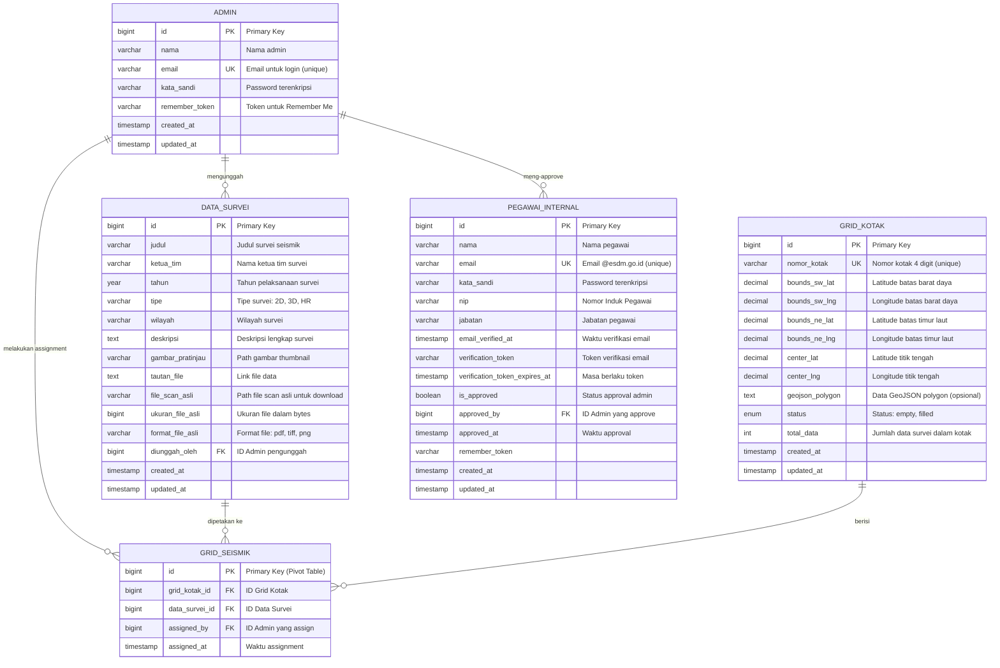

# Entity Relationship Diagram (ERD)
## Sistem Data Peta Seismik

### 📊 Deskripsi Umum
ERD ini menggambarkan struktur database dari sistem Data Peta Seismik yang digunakan untuk mengelola dan memetakan data survei seismik. Sistem ini memiliki 4 entitas utama dan 1 tabel pivot untuk relasi many-to-many.

---

## 🗃️ Diagram ERD (Mermaid Format)

---

## 📋 Deskripsi Entitas

### 1. **ADMIN** (Tabel: `admin`)
Menyimpan data administrator sistem yang dapat mengelola seluruh data dan pengaturan.

| Atribut | Tipe Data | Deskripsi |
|---------|-----------|-----------|
| `id` | BIGINT | Primary key, auto-increment |
| `nama` | VARCHAR(255) | Nama lengkap admin |
| `email` | VARCHAR(255) | Email untuk login (unique) |
| `kata_sandi` | VARCHAR(255) | Password yang sudah di-hash |
| `remember_token` | VARCHAR(100) | Token untuk fitur "Ingat Saya" |
| `created_at` | TIMESTAMP | Waktu pembuatan akun |
| `updated_at` | TIMESTAMP | Waktu update terakhir |

---

### 2. **DATA_SURVEI** (Tabel: `data_survei`)
Menyimpan informasi data survei seismik yang telah dikumpulkan.

| Atribut | Tipe Data | Deskripsi |
|---------|-----------|-----------|
| `id` | BIGINT | Primary key, auto-increment |
| `judul` | VARCHAR(255) | Judul survei seismik |
| `ketua_tim` | VARCHAR(255) | Nama ketua tim pelaksana survei |
| `tahun` | YEAR | Tahun pelaksanaan survei |
| `tipe` | VARCHAR(50) | Tipe survei: 2D, 3D, atau HR |
| `wilayah` | VARCHAR(255) | Nama wilayah survei |
| `deskripsi` | TEXT | Deskripsi lengkap survei (nullable) |
| `gambar_pratinjau` | VARCHAR(255) | Path ke file gambar thumbnail |
| `tautan_file` | TEXT | Link ke file data asli |
| `file_scan_asli` | VARCHAR(255) | Path file scan untuk pegawai |
| `ukuran_file_asli` | BIGINT | Ukuran file dalam bytes |
| `format_file_asli` | VARCHAR(50) | Format file (pdf, tiff, png, dll) |
| `diunggah_oleh` | BIGINT (FK) | ID Admin yang mengunggah |
| `created_at` | TIMESTAMP | Waktu upload data |
| `updated_at` | TIMESTAMP | Waktu update terakhir |

---

### 3. **GRID_KOTAK** (Tabel: `grid_kotak`)
Menyimpan informasi grid/kotak pada peta untuk memetakan lokasi survei.

| Atribut | Tipe Data | Deskripsi |
|---------|-----------|-----------|
| `id` | BIGINT | Primary key, auto-increment |
| `nomor_kotak` | VARCHAR(10) | Nomor identifikasi kotak (unique) |
| `bounds_sw_lat` | DECIMAL(10,6) | Latitude batas barat daya |
| `bounds_sw_lng` | DECIMAL(10,6) | Longitude batas barat daya |
| `bounds_ne_lat` | DECIMAL(10,6) | Latitude batas timur laut |
| `bounds_ne_lng` | DECIMAL(10,6) | Longitude batas timur laut |
| `center_lat` | DECIMAL(10,6) | Latitude titik tengah kotak |
| `center_lng` | DECIMAL(10,6) | Longitude titik tengah kotak |
| `geojson_polygon` | TEXT | Data GeoJSON untuk bentuk kompleks |
| `status` | ENUM | Status kotak: 'empty' atau 'filled' |
| `total_data` | INTEGER | Counter jumlah data dalam kotak |
| `created_at` | TIMESTAMP | Waktu pembuatan grid |
| `updated_at` | TIMESTAMP | Waktu update terakhir |

---

### 4. **GRID_SEISMIK** (Tabel: `grid_seismik`) - *Pivot Table*
Tabel pivot untuk relasi many-to-many antara DATA_SURVEI dan GRID_KOTAK.

| Atribut | Tipe Data | Deskripsi |
|---------|-----------|-----------|
| `id` | BIGINT | Primary key |
| `grid_kotak_id` | BIGINT (FK) | Foreign key ke grid_kotak |
| `data_survei_id` | BIGINT (FK) | Foreign key ke data_survei |
| `assigned_by` | BIGINT (FK) | ID Admin yang melakukan assignment |
| `assigned_at` | TIMESTAMP | Waktu assignment dilakukan |

---

### 5. **PEGAWAI_INTERNAL** (Tabel: `pegawai_internal`)
Menyimpan data pegawai internal ESDM yang dapat mengakses file scan.

| Atribut | Tipe Data | Deskripsi |
|---------|-----------|-----------|
| `id` | BIGINT | Primary key, auto-increment |
| `nama` | VARCHAR(255) | Nama lengkap pegawai |
| `email` | VARCHAR(255) | Email @esdm.go.id (unique) |
| `kata_sandi` | VARCHAR(255) | Password yang sudah di-hash |
| `nip` | VARCHAR(50) | Nomor Induk Pegawai |
| `jabatan` | VARCHAR(100) | Jabatan dalam instansi |
| `email_verified_at` | TIMESTAMP | Waktu verifikasi email |
| `verification_token` | VARCHAR(100) | Token untuk verifikasi email |
| `verification_token_expires_at` | TIMESTAMP | Masa berlaku token |
| `is_approved` | BOOLEAN | Status approval oleh admin |
| `approved_by` | BIGINT (FK) | ID Admin yang meng-approve |
| `approved_at` | TIMESTAMP | Waktu approval |
| `remember_token` | VARCHAR(100) | Token "Ingat Saya" |
| `created_at` | TIMESTAMP | Waktu pendaftaran |
| `updated_at` | TIMESTAMP | Waktu update terakhir |

---

## 🔗 Hubungan Antar Entitas

### 1. **ADMIN → DATA_SURVEI** (One-to-Many)
- Satu Admin dapat mengunggah banyak Data Survei
- Satu Data Survei hanya diunggah oleh satu Admin
- Foreign Key: `data_survei.diunggah_oleh` → `admin.id`

### 2. **ADMIN → PEGAWAI_INTERNAL** (One-to-Many)
- Satu Admin dapat meng-approve banyak Pegawai Internal
- Satu Pegawai Internal di-approve oleh maksimal satu Admin
- Foreign Key: `pegawai_internal.approved_by` → `admin.id`

### 3. **DATA_SURVEI ↔ GRID_KOTAK** (Many-to-Many)
- Satu Data Survei dapat dipetakan ke banyak Grid Kotak
- Satu Grid Kotak dapat memiliki banyak Data Survei
- Melalui tabel pivot: `grid_seismik`
- Foreign Keys:
  - `grid_seismik.data_survei_id` → `data_survei.id`
  - `grid_seismik.grid_kotak_id` → `grid_kotak.id`

### 4. **ADMIN → GRID_SEISMIK** (One-to-Many)
- Satu Admin dapat melakukan banyak assignment
- Satu assignment dilakukan oleh satu Admin
- Foreign Key: `grid_seismik.assigned_by` → `admin.id`

---

## 📈 Kardinalitas

| Relasi | Kardinalitas | Keterangan |
|--------|--------------|------------|
| Admin - DataSurvei | 1:N | Satu admin mengunggah banyak survei |
| Admin - PegawaiInternal | 1:N | Satu admin meng-approve banyak pegawai |
| DataSurvei - GridKotak | M:N | Satu survei bisa di banyak grid, satu grid bisa punya banyak survei |
| Admin - GridSeismik | 1:N | Satu admin melakukan banyak assignment |

