# Use Case Diagram
## Sistem Data Peta Seismik

### 📊 Deskripsi Umum
Use Case Diagram ini menggambarkan interaksi antara aktor-aktor (pengguna) dengan sistem Data Peta Seismik. Diagram ini menunjukkan fungsionalitas sistem yang dapat diakses oleh setiap aktor.

---

## 👥 Daftar Aktor

### 1. **User Publik (Pengunjung)**
Pengguna umum yang mengakses website tanpa harus login.
- **Karakteristik**: Tidak memerlukan autentikasi
- **Tujuan**: Mencari informasi survei seismik dan melihat peta interaktif

### 2. **Pegawai Internal (ESDM)**
Pegawai Kementerian ESDM yang memiliki akses khusus ke file scan asli.
- **Karakteristik**: Harus registrasi dengan email @esdm.go.id dan melalui verifikasi
- **Tujuan**: Mengakses dan mengunduh file survei seismik asli

### 3. **Admin**
Administrator sistem yang mengelola seluruh data dan pengaturan.
- **Karakteristik**: Akses penuh ke semua fitur sistem
- **Tujuan**: Mengelola data survei, grid peta, laporan, dan pengguna

---

## 📋 Diagram Use Case (Mermaid Format)

```mermaid
flowchart TB
    subgraph AKTOR
        UP[👤 User Publik]
        PI[👨‍💼 Pegawai Internal]
        AD[🔧 Admin]
    end

    subgraph SISTEM["🗺️ Sistem Data Peta Seismik"]
        subgraph UC_PUBLIK["Use Case - Akses Publik"]
            UC1[Melihat Beranda]
            UC2[Melihat Peta Interaktif]
            UC3[Melihat Katalog Data Survei]
            UC4[Melihat Detail Survei]
            UC5[Melihat Halaman Tentang Kami]
            UC6[Mengakses FAQ / Informasi]
            UC7[Mengirim Pesan Kontak]
        end
        
        subgraph UC_AUTH_PEGAWAI["Use Case - Autentikasi Pegawai"]
            UC8[Register Akun Pegawai]
            UC9[Verifikasi Email]
            UC10[Login Pegawai]
            UC11[Logout Pegawai]
        end
        
        subgraph UC_PEGAWAI["Use Case - Fitur Pegawai"]
            UC12[Mengunduh File Scan Asli]
        end
        
        subgraph UC_AUTH_ADMIN["Use Case - Autentikasi Admin"]
            UC13[Login Admin]
            UC14[Logout Admin]
            UC15[Reset Password Admin]
        end
        
        subgraph UC_ADMIN_DATA["Use Case - Kelola Data Survei"]
            UC16[Melihat Dashboard Admin]
            UC17[Melihat Daftar Data Survei]
            UC18[Menambah Data Survei Baru]
            UC19[Mengedit Data Survei]
            UC20[Menghapus Data Survei]
            UC21[Melihat Detail Data Survei]
        end
        
        subgraph UC_ADMIN_GRID["Use Case - Kelola Grid Peta"]
            UC22[Melihat Manajemen Grid]
            UC23[Assign Data ke Grid]
            UC24[Unassign Data dari Grid]
            UC25[Melihat Detail Grid]
        end
        
        subgraph UC_ADMIN_LAPORAN["Use Case - Laporan"]
            UC26[Melihat Statistik Laporan]
            UC27[Export Laporan PDF]
            UC28[Export Laporan Excel]
        end
        
        subgraph UC_ADMIN_PENGATURAN["Use Case - Pengaturan"]
            UC29[Mengelola Profil Admin]
            UC30[Mengubah Password Admin]
            UC31[Melihat Daftar Pegawai]
            UC32[Approve Pegawai Manual]
            UC33[Mengelola Admin Lain]
        end
    end

    %% Relasi User Publik
    UP --> UC1
    UP --> UC2
    UP --> UC3
    UP --> UC4
    UP --> UC5
    UP --> UC6
    UP --> UC7
    
    %% Relasi Pegawai Internal
    PI --> UC1
    PI --> UC2
    PI --> UC3
    PI --> UC4
    PI --> UC5
    PI --> UC6
    PI --> UC7
    PI --> UC8
    PI --> UC9
    PI --> UC10
    PI --> UC11
    PI --> UC12
    
    %% Relasi Admin
    AD --> UC13
    AD --> UC14
    AD --> UC15
    AD --> UC16
    AD --> UC17
    AD --> UC18
    AD --> UC19
    AD --> UC20
    AD --> UC21
    AD --> UC22
    AD --> UC23
    AD --> UC24
    AD --> UC25
    AD --> UC26
    AD --> UC27
    AD --> UC28
    AD --> UC29
    AD --> UC30
    AD --> UC31
    AD --> UC32
    AD --> UC33
```

---

## 📝 Deskripsi Use Case Detail

### 🌐 Use Case - Akses Publik

| No | Use Case | Aktor | Deskripsi |
|----|----------|-------|-----------|
| UC1 | Melihat Beranda | User Publik, Pegawai | Menampilkan halaman utama website dengan ringkasan informasi dan statistik data seismik |
| UC2 | Melihat Peta Interaktif | User Publik, Pegawai | Menampilkan peta interaktif Indonesia dengan grid kotak yang menunjukkan lokasi data survei |
| UC3 | Melihat Katalog Data Survei | User Publik, Pegawai | Menampilkan daftar seluruh data survei dengan fitur pencarian dan filter |
| UC4 | Melihat Detail Survei | User Publik, Pegawai | Menampilkan informasi lengkap dari satu data survei termasuk gambar pratinjau |
| UC5 | Melihat Halaman Tentang Kami | User Publik, Pegawai | Menampilkan informasi tentang organisasi dan tujuan sistem |
| UC6 | Mengakses FAQ / Informasi | User Publik, Pegawai | Menampilkan halaman FAQ dan informasi bantuan |
| UC7 | Mengirim Pesan Kontak | User Publik, Pegawai | Mengisi dan mengirimkan form kontak untuk pertanyaan |

---

### 🔐 Use Case - Autentikasi Pegawai

| No | Use Case | Aktor | Deskripsi | Pre-condition | Post-condition |
|----|----------|-------|-----------|---------------|----------------|
| UC8 | Register Akun Pegawai | Pegawai | Mendaftarkan akun baru dengan email @esdm.go.id | Belum punya akun | Akun terbuat, menunggu verifikasi email |
| UC9 | Verifikasi Email | Pegawai | Memverifikasi email melalui link yang dikirimkan | Sudah register | Akun terverifikasi, bisa login |
| UC10 | Login Pegawai | Pegawai | Masuk ke sistem dengan email dan password | Akun terverifikasi/approved | Session aktif |
| UC11 | Logout Pegawai | Pegawai | Keluar dari sistem | Sudah login | Session berakhir |

---

### 📥 Use Case - Fitur Pegawai

| No | Use Case | Aktor | Deskripsi | Pre-condition | Post-condition |
|----|----------|-------|-----------|---------------|----------------|
| UC12 | Mengunduh File Scan Asli | Pegawai | Mengunduh file scan asli dari data survei (tidak tersedia untuk publik) | Login sebagai pegawai terverifikasi | File terdownload |

---

### 🔒 Use Case - Autentikasi Admin

| No | Use Case | Aktor | Deskripsi | Pre-condition | Post-condition |
|----|----------|-------|-----------|---------------|----------------|
| UC13 | Login Admin | Admin | Masuk ke panel admin | Memiliki akun admin | Session admin aktif |
| UC14 | Logout Admin | Admin | Keluar dari panel admin | Sudah login admin | Session berakhir |
| UC15 | Reset Password Admin | Admin | Memulihkan password melalui email | Lupa password | Password baru dikirim via email |

---

### 📊 Use Case - Kelola Data Survei

| No | Use Case | Aktor | Deskripsi | Pre-condition | Post-condition |
|----|----------|-------|-----------|---------------|----------------|
| UC16 | Melihat Dashboard Admin | Admin | Menampilkan ringkasan statistik dan aktivitas terbaru | Login admin | Dashboard ditampilkan |
| UC17 | Melihat Daftar Data Survei | Admin | Menampilkan semua data survei dengan filter dan sorting | Login admin | Daftar data ditampilkan |
| UC18 | Menambah Data Survei Baru | Admin | Mengisi form untuk menambah data survei baru | Login admin | Data survei tersimpan |
| UC19 | Mengedit Data Survei | Admin | Mengubah informasi data survei yang sudah ada | Data survei ada | Data survei terupdate |
| UC20 | Menghapus Data Survei | Admin | Menghapus data survei dari sistem | Data survei ada | Data survei terhapus |
| UC21 | Melihat Detail Data Survei | Admin | Menampilkan informasi lengkap satu data survei di panel admin | Data survei ada | Detail ditampilkan |

---

### 🗺️ Use Case - Kelola Grid Peta

| No | Use Case | Aktor | Deskripsi | Pre-condition | Post-condition |
|----|----------|-------|-----------|---------------|----------------|
| UC22 | Melihat Manajemen Grid | Admin | Menampilkan peta dengan grid kotak dan daftar data yang belum di-assign | Login admin | Peta grid ditampilkan |
| UC23 | Assign Data ke Grid | Admin | Memetakan data survei ke kotak grid tertentu | Data survei ada, grid ada | Data ter-assign ke grid |
| UC24 | Unassign Data dari Grid | Admin | Menghapus pemetaan data survei dari grid | Data sudah ter-assign | Data tidak lagi di grid tersebut |
| UC25 | Melihat Detail Grid | Admin | Menampilkan informasi grid dan semua data survei di dalamnya | Grid ada | Detail grid ditampilkan |

---

### 📈 Use Case - Laporan

| No | Use Case | Aktor | Deskripsi | Pre-condition | Post-condition |
|----|----------|-------|-----------|---------------|----------------|
| UC26 | Melihat Statistik Laporan | Admin | Menampilkan statistik dan grafik data survei | Login admin | Laporan ditampilkan |
| UC27 | Export Laporan PDF | Admin | Mengunduh laporan dalam format PDF | Login admin | File PDF terdownload |
| UC28 | Export Laporan Excel | Admin | Mengunduh laporan dalam format Excel/CSV | Login admin | File Excel terdownload |

---

### ⚙️ Use Case - Pengaturan

| No | Use Case | Aktor | Deskripsi | Pre-condition | Post-condition |
|----|----------|-------|-----------|---------------|----------------|
| UC29 | Mengelola Profil Admin | Admin | Mengubah informasi profil seperti nama dan email | Login admin | Profil terupdate |
| UC30 | Mengubah Password Admin | Admin | Mengganti password akun admin | Login admin | Password terupdate |
| UC31 | Melihat Daftar Pegawai | Admin | Menampilkan semua pegawai internal yang terdaftar | Login admin | Daftar pegawai ditampilkan |
| UC32 | Approve Pegawai Manual | Admin | Menyetujui akun pegawai secara manual (jika email tidak terkirim) | Pegawai pending | Pegawai dapat login |
| UC33 | Mengelola Admin Lain | Admin | Menambah, mengedit, atau menghapus akun admin lain | Login admin | Daftar admin terupdate |

---

## 🔄 Skenario Use Case

### Skenario UC18: Menambah Data Survei Baru

**Aktor**: Admin

**Pre-condition**: 
- Admin sudah login ke sistem
- Admin berada di halaman manajemen data survei

**Main Flow**:
1. Admin mengklik tombol "Tambah Data Survei"
2. Sistem menampilkan form input data survei
3. Admin mengisi field yang diperlukan:
   - Judul survei
   - Ketua tim
   - Tahun survei
   - Tipe (2D/3D/HR)
   - Wilayah
   - Deskripsi
   - Upload gambar pratinjau
   - Upload file scan asli (opsional)
   - Tautan file (opsional)
4. Admin mengklik tombol "Simpan"
5. Sistem memvalidasi input
6. Sistem menyimpan data ke database
7. Sistem menampilkan pesan sukses
8. Sistem redirect ke halaman daftar data survei

**Alternative Flow**:
- 5a. Jika validasi gagal, sistem menampilkan pesan error dan kembali ke form

**Post-condition**: 
- Data survei baru tersimpan di database
- Data survei muncul di katalog publik

---

### Skenario UC23: Assign Data ke Grid

**Aktor**: Admin

**Pre-condition**: 
- Admin sudah login ke sistem
- Ada data survei yang belum ter-assign
- Grid kotak tersedia di sistem

**Main Flow**:
1. Admin membuka halaman Manajemen Grid
2. Sistem menampilkan peta dengan grid kotak
3. Admin melihat daftar data survei yang belum ter-assign
4. Admin melakukan drag-and-drop data survei ke grid kotak yang diinginkan
5. Sistem menampilkan konfirmasi assignment
6. Admin mengkonfirmasi
7. Sistem menyimpan relasi data-grid ke tabel pivot
8. Sistem mengupdate status grid menjadi "filled"
9. Sistem menampilkan notifikasi sukses

**Alternative Flow**:
- 7a. Jika data sudah ter-assign ke grid tersebut, sistem menampilkan pesan error

**Post-condition**: 
- Data survei ter-assign ke grid kotak
- Status grid menjadi "filled"
- Data muncul di peta publik pada lokasi grid tersebut

---

### Skenario UC8: Register Akun Pegawai

**Aktor**: Pegawai Internal

**Pre-condition**: 
- Pegawai memiliki email @esdm.go.id
- Pegawai belum memiliki akun di sistem

**Main Flow**:
1. Pegawai mengakses halaman registrasi pegawai
2. Sistem menampilkan form registrasi
3. Pegawai mengisi data:
   - Nama lengkap
   - Email (harus @esdm.go.id)
   - NIP (opsional)
   - Jabatan (opsional)
   - Password
   - Konfirmasi password
4. Pegawai mengklik tombol "Daftar"
5. Sistem memvalidasi email @esdm.go.id
6. Sistem membuat akun dengan status belum terverifikasi
7. Sistem mengirim email verifikasi
8. Sistem redirect ke halaman login dengan pesan untuk cek email

**Alternative Flow**:
- 5a. Jika email bukan @esdm.go.id, sistem menampilkan error
- 7a. Jika email gagal terkirim, sistem menampilkan pesan untuk menghubungi admin

**Post-condition**: 
- Akun pegawai terbuat dengan status pending
- Email verifikasi terkirim (jika sukses)

---

## 🎯 Ringkasan Use Case per Aktor

| Aktor | Jumlah Use Case | Kategori |
|-------|-----------------|----------|
| User Publik | 7 | Akses Publik |
| Pegawai Internal | 12 | Akses Publik + Autentikasi + Download |
| Admin | 21 | Pengelolaan Sistem Lengkap |

